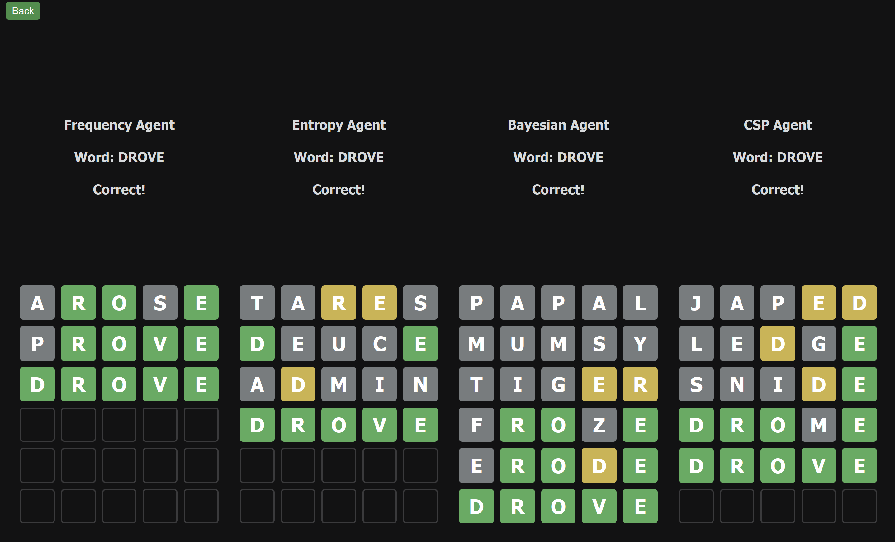
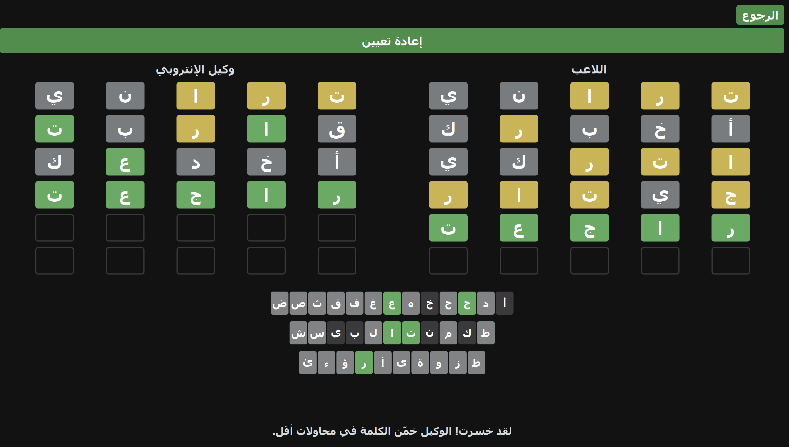

# 🧠 Arabic–English Wordle AI Solver

A **bilingual AI-powered Wordle solver** supporting **English and Arabic**, built to compare and evaluate multiple intelligent decision-making strategies.

This project explores how different AI techniques perform when solving Wordle-like games, with a strong focus on **information theory, probabilistic reasoning, and constraint satisfaction** — all wrapped in a playable application.

---

## 🚀 Key Features

- 🌍 **Bilingual Support**: English & Arabic Wordle
- 🤖 **Four AI Agents**:
  - Constraint Satisfaction (CSP)
  - Letter Frequency Heuristics
  - Bayesian Updating
  - Entropy Maximization (Information Gain)
- 📊 **Performance Evaluation**: Win rate, guess efficiency, and runtime
- 🧪 **Agent-vs-Agent & Human Comparison**
- ⚡ Optimized with caching for entropy computations

---

## 🖼️ Demo & Visuals

### 🔤 English Mode – AI Agent Comparison
*Side-by-side comparison of AI agents solving English Wordle*



---

### 🧑‍💻 Arabic Mode – Playing Against the AI
*Human player competing against the AI solver in Arabic Wordle*



---

### 🧪 Arabic Mode – AI Stress Testing
*Testing AI robustness and decision-making in Arabic Wordle*


---

## 🏆 Performance Summary

| Agent | Win Rate | Avg. Guesses | Avg. Time |
|------|---------|--------------|-----------|
| **Entropy Maximization** | **100%** | **3.92** | 6.47s |
| Frequency Heuristic | 95.63% | 4.04 | 0.04s |
| CSP | 94.99% | 4.40 | 0.03s |
| Bayesian | 94.81% | 4.40 | 0.52s |

> **Insight:**  
> The Entropy agent consistently minimizes guesses by maximizing expected information gain, at the cost of higher computation time.

---

## 🛠️ Tech Stack

- Python
- NumPy / Pandas
- Probability & Information Theory
- Constraint Solving
- Custom Arabic word datasets

---

## ⚙️ Setup & Installation

### 1️⃣ Create a Virtual Environment

**Windows**
```powershell
py -m venv .venv
